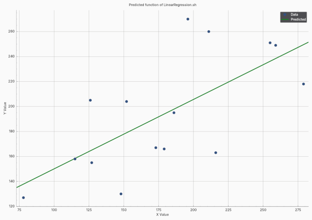
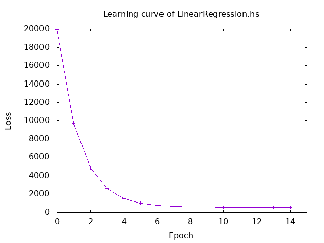
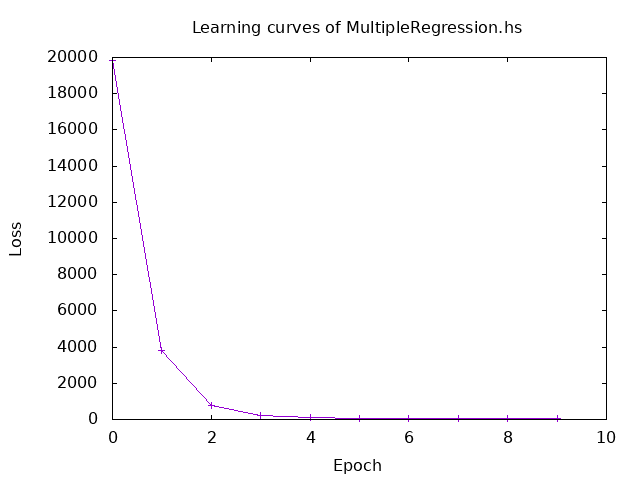
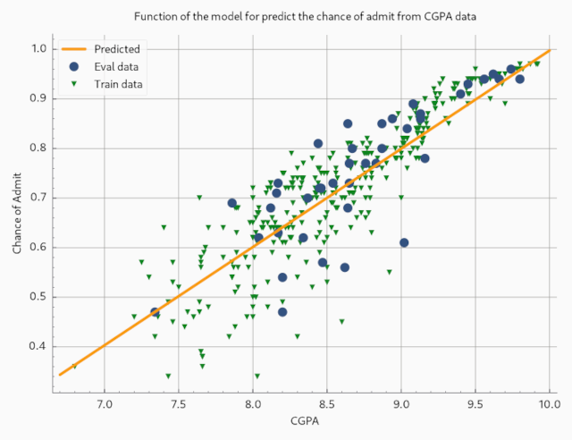
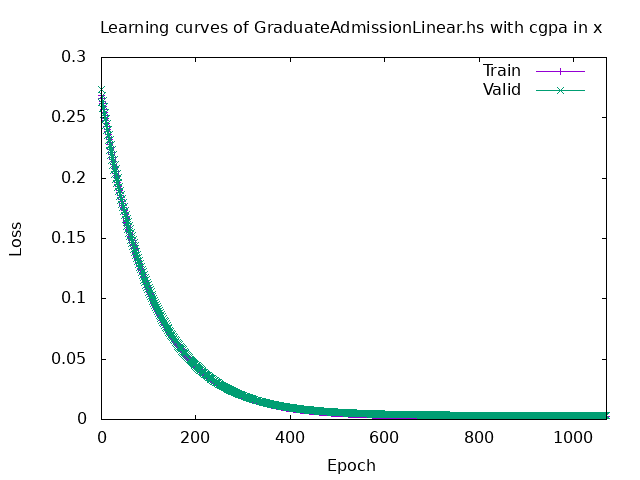

# Session 3 Report - Linear Regression and Gradient Descent
## 3 - Train linear regression model from scratch with sample data
### Raw results
```
Train
------
Epoch 1 | Loss : Tensor Float []  19957.4668
******
Epoch 15 | Loss : Tensor Float []  559.2198
******
Test
------
correct answer: 260.0
estimated: 212.5025
******
correct answer: 249.0
estimated: 239.25253
******
correct answer: 251.0
estimated: 237.02335
******
correct answer: 158.0
estimated: 159.00244
******
correct answer: 167.0
estimated: 191.3254
******
Result
------
Final a : Tensor Float []  0.5573
Final b : Tensor Float []  94.9138
```

### Explanation
My final parameters are a learning rate of 0.0000255 for `a` and 0.82 for `b`. After 15 epochs, I obtain a loss of 559.2198. This corresponds to weights of approximately 0.5573 for `a` and 94.9138 for `b`. The learning rates for `a` and `b` are not identical because the data has not been normalized. The calculation of the new `a` in gradient descent depends on the data; so, with big data, `a` changes much faster than `b`.

 
*Fig. 1 - The data and the line obtained from the regression model.*

As can be seen in *Fig. 1*, the data are not very linear and fare from the predicted line. This explains why the loss remains very high.

 
*Fig. 2 - The learning curve of model training.*

As can be seen in Fig. 2, the learning curve confirms that the model is training effectively. The loss, which was initially very high, decreases gradually and begins to converge after the 10th epoch.
___
## 4 - Train a multiple linear regression model where the predicted y depends on multiple input features x
### Raw results
```
Train
------
Epoch 1 | Train Loss : Tensor Float []  19818.5000
******
Epoch 10 | Train Loss : Tensor Float []  60.3975
******
Test
------
correct answer: 123.0
estimated: 125.801544
******
correct answer: 290.0
estimated: 279.75464
******
correct answer: 230.0
estimated: 229.9762
******
correct answer: 261.0
estimated: 265.49408
******
correct answer: 140.0
estimated: 141.49022
Result
------
Final a1 : Tensor Float []  0.5670
Final a2 : Tensor Float []  0.4738
Final b : Tensor Float []  2.0065
```
### Explanation
 
*Fig. 5*
___
## 5 - Predict graduate admission with Linear Regression
Based on the cgpa values in `x`, the best parameters I found are 1070 epochs with a learning rate of 0.015 for `a` and 0.89 for `b`. I obtained a loss of 3.3003e-3, which corresponds to weights of approximately 0.1982 for `a` and -0.9843 for `b`. This gives us the prediction line in *Fig. 4*.

 
*Fig. 4*

 
*Fig. 5*
