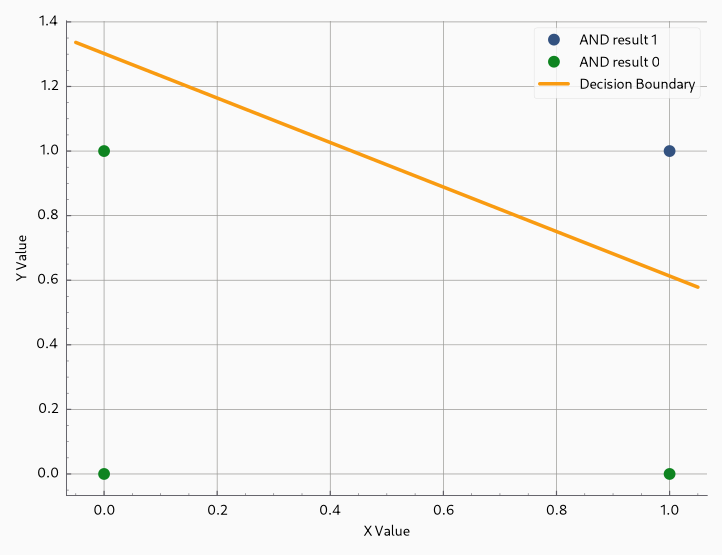
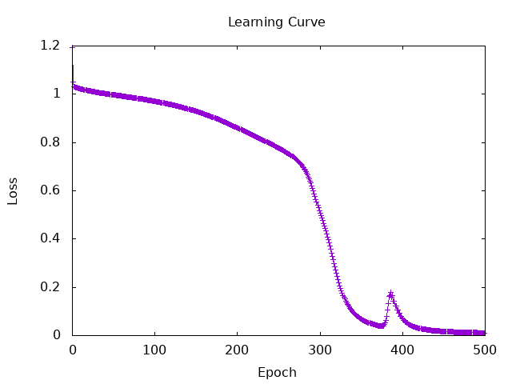
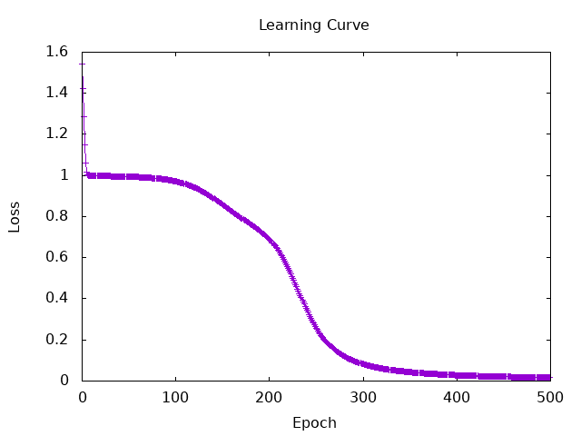

# Session 4 Report - Perceptron

## Build and train an AND gate using a simple perceptron

### Raw results

```text
Epoch 1 | Total Error: 2.0
Epoch 2 | Total Error: 2.0
Epoch 3 | Total Error: 2.0
Epoch 4 | Total Error: 1.0
Epoch 5 | Total Error: 0.0
End at epoch 5 with weights [0.33749682,0.4897931] and bias -0.6378146
```

### Explanation

To solve the AND gate problem, the perceptron acts as a linear classifier. Its goal is to find a decision boundary in a 2D space that separates the point `(1,1)` from the points `(1,0)`, `(0,1)`, and `(0,0)`. We can see above, it takes only 5 epochs to converge.



## Build a XOR gate using a multi-layer perceptron

### Implementation

To solve the XOR gate problem, we use a multi-layer perceptron with two input, one hidden layer has two neurons and the output layer has one neuron. Between each layer and for the output, we uses the tanh activation function of Torch. Is for adding non linearity to the model.

```haskell
MLPSpec
  { feature_counts = [2, 2, 1],
    nonlinearitySpec = Torch.tanh
  }
```
The perceptron is trained using backpropagation and gradient descent.
For the loss function, we use the mean squared error (MSE) loss of Torch. The MSE loss is defined as the average of the squared differences between the predicted output and the true output.

The second implementation use the mlp of Torch and use a Sigmoid activation function. The data are in a list of tuples and generated using a cycle and not by a function.

### Results with Tanh activation function

With a learning rate of 0.1 and 500 epochs.

```Text
Iteration: 50 | Loss: 0.9977491
Iteration: 100 | Loss: 0.97129655
Iteration: 150 | Loss: 0.9301492
Iteration: 200 | Loss: 0.8619797
Iteration: 250 | Loss: 0.77862155
Iteration: 300 | Loss: 0.51838154
Iteration: 350 | Loss: 7.082051e-2
Iteration: 400 | Loss: 7.185207e-2
Iteration: 450 | Loss: 1.7303381e-2
Iteration: 500 | Loss: 1.0963717e-2

Final Model Predictions:
[0.0,0.0] => -1.404798e-2
[0.0,1.0] => 0.93691826
[1.0,0.0] => 0.9223747
[1.0,1.0] => -2.6753724e-2
```



### Results with Sigmoid activation function

With a learning rate of 0.7 and 500 epochs.

```Text
Iteration: 50 | Loss: 0.9944419
Iteration: 100 | Loss: 0.97222465
Iteration: 150 | Loss: 0.86106294
Iteration: 200 | Loss: 0.6932998
Iteration: 250 | Loss: 0.2650185
Iteration: 300 | Loss: 8.3653085e-2
Iteration: 350 | Loss: 4.3620013e-2
Iteration: 400 | Loss: 2.8497107e-2
Iteration: 450 | Loss: 2.085629e-2
Iteration: 500 | Loss: 1.6322214e-2

Final Model Predictions:
[0.0,0.0] => 6.4420365e-2
[0.0,1.0] => 0.9429366
[1.0,0.0] => 0.9246826
[1.0,1.0] => 5.6317203e-2
```



### Conclusion

The Tanh activation function seems to perform better than the Sigmoid activation function for this XOR problem. Sigmoid need a higher learning rate to converge as it go to extreme values more easily. For me the sigmoid look better because it have a range of (0, 1) and we want our output to be in this range.
