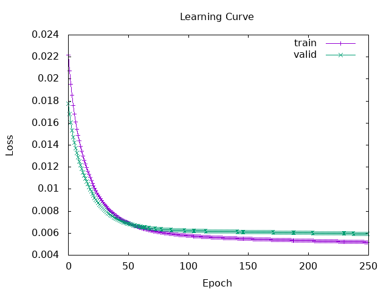
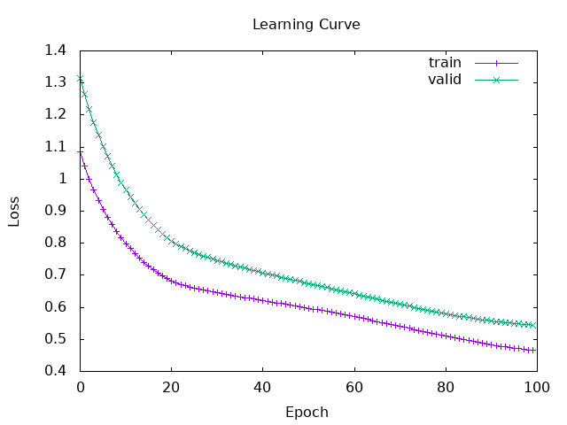

# Session 5 Report - Classification and Evaluation scores

## 1 - Evaluation

- **True Positive** ($TP$) : The **positive** cases that the model **correctly predicted**.
- **False Negative** ($FN$) : The **positive** cases that the model **predicted to be negative**.
- **True Negative** ($TN$) : The **negative** cases that the model **correctly predicted**.
- **False Positive** ($FP$) : The **negative** cases that the model **predicted as positive**.

| v Actual / Predicted > | Positive | Negative |
| ---------------------- | -------- | -------- |
| Positive               | $TP$     | $FN$     |
| Negative               | $FP$     | $TN$     |

## Sensitivity or Recall

The **true positive rate** ($TPR$) is the proportion of positive items correctly predicted by the model. The question is **"On all positive cases, how many was the model able to predict?"** *(Sur l'ensemble des cas positifs, combien le modèle a-t-il réussi à prédire ?)*. The goal is to **avoid false negative** ($-FN$). 

$$\text{TPR}=\frac{TP}{TP+FN}$$

The complement is the **false negative rate** ($FNR$).

$$\text{FNR}=\frac{FN}{TP+FN}$$

## Specificity ($SPC$)

The **true negative rate** ($TNR$) is the proportion of negative items correctly predicted by the model. 

$$\text{TNR}=\frac{TN}{TN+FP}$$

The complement is the **false positive rate** ($FPR$).

$$\text{FPR}=\frac{FP}{TN+FP}$$

## Precision

The **positive predicted value** ($PPV$) is the proportion of positive predictions that were actually correct. The question is: "Out of all the cases the model predicted as positive, how many were actually positive?". 

$$\text{PPV}=\frac{TP}{TP+FP}$$

## Negative Predictive Value ($NPV$)

The **negative predictive value** is the proportion of negative predictions that were actually correct.

$$\text{NPV}=\frac{TN}{TN+FN}$$

## Accuracy

Accuracy is the proportion of all predictions (both positive and negative) that were correct out of the total number of cases.

$$\text{Accuracy}=\frac{TP+TN}{TP+TN+FP+FN}$$

## F1-Score

The F1-Score is the harmonic mean of Precision and Recall. It is an excellent metric to use when you have an imbalanced dataset, as it provides a single score that balances both the false positives and false negatives.

$$\text{F1}=2 \times \frac{\text{Precision} \times \text{Recall}}{\text{Precision} + \text{Recall}} = \frac{2TP}{2TP+FP+FN}$$

## 2 - Predict graduate admission with a multi-layer perceptron

### Raw results

My model has 3 input, 1 hidden layers of 4 and 1 output with Sigmoid activations.

```haskell
hypParams :: MLPHypParams
hypParams = MLPHypParams (Device CPU 0) 3 [(4, Sigmoid), (1, Sigmoid)]
````

With 250 epochs, a learning rate of 9e-1 and the mean squared error loss function I got the following results:

```Texte
Train
------
  Epoch   50 | Train Loss:  6.956004e-3 | Val Loss:  6.891655e-3
  Epoch  100 | Train Loss:  5.776943e-3 | Val Loss:  6.227854e-3
  Epoch  150 | Train Loss:  5.483132e-3 | Val Loss:  6.111062e-3
  Epoch  200 | Train Loss:  5.313278e-3 | Val Loss:  6.023412e-3
  Epoch  250 | Train Loss:  5.182473e-3 | Val Loss:  5.943791e-3

Test
------
  Predicted: 0.7668 | actual: 0.77
  Predicted: 0.7813 | actual: 0.85
  Predicted: 0.8827 | actual: 0.95
  Predicted: 0.8232 | actual: 0.89
  Predicted: 0.5831 | actual: 0.54
  Predicted: 0.4817 | actual: 0.69
  Predicted: 0.8181 | actual: 0.87
  Predicted: 0.6663 | actual: 0.72
  Predicted: 0.8224 | actual: 0.93
  Predicted: 0.7315 | actual: 0.81

Result
------
             precision    recall    f1-score    support
             ------------------------------------------
    Class  0      0.61      0.92        0.73         12
    Class  1      0.95      0.75        0.84         28
             ------------------------------------------
    accuracy                            0.80         40
   macro avg      0.78      0.83        0.79         40
weighted avg      0.85      0.80        0.81         40

Confusion Matrix
+----------+--------+--------+
|          | Pred 0 | Pred 1 |
+----------+--------+--------+
| Actual 0 |     11 |      1 |
+----------+--------+--------+
| Actual 1 |      7 |     21 |
+----------+--------+--------+
```



### Analysis
The model was trained over 250 epochs and demonstrated stable convergence with no signs of overfitting, as the validation loss closely tracked the training loss throughout. It achieved an overall accuracy of 80%. The model is highly precise (95%) when predicting the admision (Class 1), whereas it successfully identifies almost all no admition (Class 0) instances but generates several false positives. 

## 4.a - Loss Functions
- **Actual Value ($y$):** The true target value or label from your dataset.
- **Predicted Value ($\hat{y}$):** The value or probability predicted by the model.
- **Number of samples ($N$):** The total number of observations in your dataset.

A **Loss Function** measures how poorly the model is performing. The goal of any machine learning model is to minimize this loss.

### Regression Loss Functions

*Used when the model predicts a continuous numerical value (e.g., price, temperature, age).*

#### Mean Squared Error (MSE) / L2 Loss

MSE measures the average of the squares of the errors. The question is: "What is the average squared magnitude of our mistakes?" Because the errors are squared, MSE heavily penalizes large errors (outliers).

$$\text{MSE} = \frac{1}{N} \sum_{i=1}^{N} (y_i - \hat{y}_i)^2$$

#### Mean Absolute Error (MAE) / L1 Loss

MAE measures the average magnitude of the errors without considering their direction. The question is: "On average, how far off are our predictions in absolute terms?" Unlike MSE, it treats all errors equally and is more robust to outliers.

$$\text{MAE} = \frac{1}{N} \sum_{i=1}^{N} |y_i - \hat{y}_i|$$

#### Root Mean Squared Error (RMSE)

RMSE is simply the square root of the MSE. The goal is to bring the error metric back to the same unit as the target variable, making it easier to interpret.

$$\text{RMSE} = \sqrt{\frac{1}{N} \sum_{i=1}^{N} (y_i - \hat{y}_i)^2}$$

### Classification Loss Functions

*Used when the model predicts discrete classes or probabilities.*

#### Binary Cross-Entropy (BCE) / Log Loss

BCE is the standard loss function for binary classification (two classes: 0 and 1). The prediction ($\hat{y}$) is a probability between 0 and 1. The question is: "How far is the predicted probability from the actual class label?" The goal is to heavily penalize predictions that are both confident and wrong.

$$\text{BCE} = - \frac{1}{N} \sum_{i=1}^{N} \left[ y_i \log(\hat{y}_i) + (1 - y_i) \log(1 - \hat{y}_i) \right]$$

#### Categorical Cross-Entropy (CCE)

CCE is used for multi-class classification tasks (where classes are mutually exclusive, e.g., predicting exactly one animal out of cat, dog, or bird). It compares the predicted probability distribution across all classes ($C$) with the actual one-hot encoded true distribution.

$$\text{CCE} = - \frac{1}{N} \sum_{i=1}^{N} \sum_{c=1}^{C} y_{i,c} \log(\hat{y}_{i,c})$$

#### Hinge Loss

Mainly used with Support Vector Machines (SVM) for binary classification. The output relies on the raw model output (logits) rather than probabilities. The goal is to ensure not just correct classification, but a sufficient "margin" of confidence between classes. (Note: Here $y_i$ is typically -1 or 1).

$$\text{Hinge Loss} = \frac{1}{N} \sum_{i=1}^{N} \max(0, 1 - y_i \cdot \hat{y}_i)$$

## 5 - Titanic

### Raw Results

My model has 6 input, 2 hidden layers of 8 and 4 units with ReLU activations and 1 output with Sigmoid activation.

```haskell
hypParams :: MLPHypParams
hypParams = MLPHypParams (Device CPU 0) 6 [(8, Relu), (4, Relu), (1, Sigmoid)]
````

With 100 epochs, a learning rate of 1e-1 and the binary cross-entropy loss function I got the following results:

```text
Train
------
  Epoch   50 | Train Loss:  5.996758e-1 | Val Loss:  6.774455e-1
  Epoch  100 | Train Loss:  4.652970e-1 | Val Loss:  5.449292e-1

Test
------
  Predicted: 0.2077 | actual: 0.00
  Predicted: 0.6907 | actual: 1.00
  Predicted: 0.4904 | actual: 0.00
  Predicted: 0.1755 | actual: 1.00
  Predicted: 0.1349 | actual: 0.00
  Predicted: 0.2074 | actual: 0.00
  Predicted: 0.7127 | actual: 1.00
  Predicted: 0.6285 | actual: 1.00
  Predicted: 0.1735 | actual: 1.00
  Predicted: 0.4092 | actual: 0.00

Result
------
             precision    recall    f1-score    support
             ------------------------------------------
    Class  0      0.80      0.92        0.86         53
    Class  1      0.86      0.68        0.76         37
             ------------------------------------------
    accuracy                            0.82         90
   macro avg      0.83      0.80        0.81         90
weighted avg      0.83      0.82        0.82         90

Confusion Matrix
+----------+--------+--------+
|          | Pred 0 | Pred 1 |
+----------+--------+--------+
| Actual 0 |     49 |      4 |
+----------+--------+--------+
| Actual 1 |     12 |     25 |
+----------+--------+--------+
```



### Analysis

The model achieving an overall accuracy of 82%. The learning curves demonstrate good generalization with no signs of overfitting. The model is highly capable of identifying the death class (Class 0) with a 92% recall, but it struggles to capture all instances of the survival class (Class 1), yielding a lower recall of 68% and producing 12 false negatives. While the model is highly precise (86%) when it does predict Class 1.
