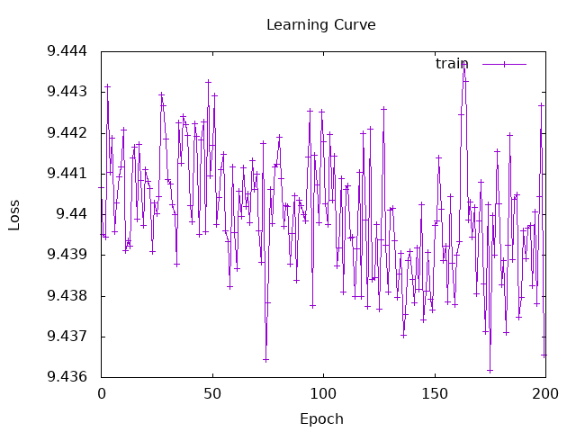
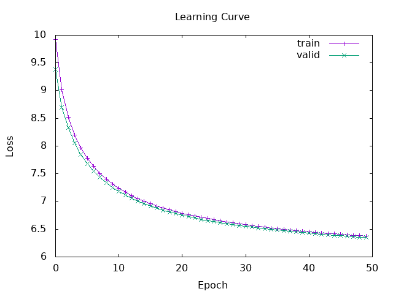

# Session 6 Report - Word Embeddings

## 1 - Build Word2Vec

I take a very long time to understand how word embeddings work and how the training process works.

My first version of the Word2Vec model gave me a learning curve that showed the model is very bad and not converging.



After, i tried to improve the model by implementing batches and augmenting the training data. But I have a lot of probleme whith my limited computational resources. 



```
Vocab Size      : 37795
Embedding Dim   : 128
Epoch 1
  Training 4830/4830
  Validation 1074/1074
  Train Loss:   9.926477e0 | Val Loss:   9.385764e0
Epoch 2
  Training 4830/4830
  Validation 1074/1074
  Train Loss:   9.020374e0 | Val Loss:   8.700562e0
Epoch 3
  Training 4830/4830
  Validation 1074/1074
  Train Loss:   8.515159e0 | Val Loss:   8.326175e0
Epoch 4
  Training 4830/4830
  Validation 1074/1074
  Train Loss:   8.202772e0 | Val Loss:   8.055314e0
Epoch 5
  Training 4830/4830
  Validation 1074/1074
  Train Loss:   7.965219e0 | Val Loss:   7.845946e0
Epoch 6
  Training 4830/4830
  Validation 1074/1074
  Train Loss:   7.779564e0 | Val Loss:   7.679383e0
Epoch 7
  Training 4830/4830
  Validation 1074/1074
  Train Loss:   7.630225e0 | Val Loss:   7.544401e0
Epoch 8
  Training 4830/4830
  Validation 1074/1074
  Train Loss:   7.507968e0 | Val Loss:   7.432486e0
Epoch 9
  Training 4830/4830
  Validation 1074/1074
  Train Loss:   7.405191e0 | Val Loss:   7.337024e0
Epoch 10
  Training 4830/4830
  Validation 1074/1074
  Train Loss:   7.316328e0 | Val Loss:   7.253598e0
Epoch 11
  Training 4830/4830
  Validation 1074/1074
  Train Loss:   7.238267e0 | Val Loss:   7.180129e0
Epoch 12
  Training 4830/4830
  Validation 1074/1074
  Train Loss:   7.169459e0 | Val Loss:   7.115329e0
Epoch 13
  Training 4830/4830
  Validation 1074/1074
  Train Loss:   7.108598e0 | Val Loss:   7.057866e0
Epoch 14
  Training 4830/4830
  Validation 1074/1074
  Train Loss:   7.054394e0 | Val Loss:   7.006392e0
Epoch 15
  Training 4830/4830
  Validation 1074/1074
  Train Loss:   7.005584e0 | Val Loss:   6.959858e0
Epoch 16
  Training 4830/4830
  Validation 1074/1074
  Train Loss:   6.961264e0 | Val Loss:   6.917472e0
Epoch 17
  Training 4830/4830
  Validation 1074/1074
  Train Loss:   6.920758e0 | Val Loss:   6.878697e0
Epoch 18
  Training 4830/4830
  Validation 1074/1074
  Train Loss:   6.883623e0 | Val Loss:   6.843121e0
Epoch 19
  Training 4830/4830
  Validation 1074/1074
  Train Loss:   6.849499e0 | Val Loss:   6.810407e0
Epoch 20
  Training 4830/4830
  Validation 1074/1074
  Train Loss:   6.818065e0 | Val Loss:   6.780213e0
Epoch 21
  Training 4830/4830
  Validation 1074/1074
  Train Loss:   6.788966e0 | Val Loss:   6.752217e0
Epoch 22
  Training 4830/4830
  Validation 1074/1074
  Train Loss:   6.761937e0 | Val Loss:   6.726128e0
Epoch 23
  Training 4830/4830
  Validation 1074/1074
  Train Loss:   6.736667e0 | Val Loss:   6.701707e0
Epoch 24
  Training 4830/4830
  Validation 1074/1074
  Train Loss:   6.712962e0 | Val Loss:   6.678783e0
Epoch 25
  Training 4830/4830
  Validation 1074/1074
  Train Loss:   6.690680e0 | Val Loss:   6.657219e0
Epoch 26
  Training 4830/4830
  Validation 1074/1074
  Train Loss:   6.669704e0 | Val Loss:   6.636930e0
Epoch 27
  Training 4830/4830
  Validation 1074/1074
  Train Loss:   6.649921e0 | Val Loss:   6.617798e0
Epoch 28
  Training 4830/4830
  Validation 1074/1074
  Train Loss:   6.631248e0 | Val Loss:   6.599709e0
Epoch 29
  Training 4830/4830
  Validation 1074/1074
  Train Loss:   6.613551e0 | Val Loss:   6.582574e0
Epoch 30
  Training 4830/4830
  Validation 1074/1074
  Train Loss:   6.596745e0 | Val Loss:   6.566296e0
Epoch 31
  Training 4830/4830
  Validation 1074/1074
  Train Loss:   6.580755e0 | Val Loss:   6.550794e0
Epoch 32
  Training 4830/4830
  Validation 1074/1074
  Train Loss:   6.565511e0 | Val Loss:   6.536011e0
Epoch 33
  Training 4830/4830
  Validation 1074/1074
  Train Loss:   6.550954e0 | Val Loss:   6.521892e0
Epoch 34
  Training 4830/4830
  Validation 1074/1074
  Train Loss:   6.537022e0 | Val Loss:   6.508391e0
Epoch 35
  Training 4830/4830
  Validation 1074/1074
  Train Loss:   6.523682e0 | Val Loss:   6.495464e0
Epoch 36
  Training 4830/4830
  Validation 1074/1074
  Train Loss:   6.510896e0 | Val Loss:   6.483086e0
Epoch 37
  Training 4830/4830
  Validation 1074/1074
  Train Loss:   6.498661e0 | Val Loss:   6.471221e0
Epoch 38
  Training 4830/4830
  Validation 1074/1074
  Train Loss:   6.486916e0 | Val Loss:   6.459832e0
Epoch 39
  Training 4830/4830
  Validation 1074/1074
  Train Loss:   6.475655e0 | Val Loss:   6.448917e0
Epoch 40
  Training 4830/4830
  Validation 1074/1074
  Train Loss:   6.464827e0 | Val Loss:   6.438420e0
Epoch 41
  Training 4830/4830
  Validation 1074/1074
  Train Loss:   6.454406e0 | Val Loss:   6.428319e0
Epoch 42
  Training 4830/4830
  Validation 1074/1074
  Train Loss:   6.444380e0 | Val Loss:   6.418585e0
Epoch 43
  Training 4830/4830
  Validation 1074/1074
  Train Loss:   6.434713e0 | Val Loss:   6.409200e0
Epoch 44
  Training 4830/4830
  Validation 1074/1074
  Train Loss:   6.425357e0 | Val Loss:   6.400130e0
Epoch 45
  Training 4830/4830
  Validation 1074/1074
  Train Loss:   6.416326e0 | Val Loss:   6.391357e0
Epoch 46
  Training 4830/4830
  Validation 1074/1074
  Train Loss:   6.407594e0 | Val Loss:   6.382867e0
Epoch 47
  Training 4830/4830
  Validation 1074/1074
  Train Loss:   6.399108e0 | Val Loss:   6.374645e0
Epoch 48
  Training 4830/4830
  Validation 1074/1074
  Train Loss:   6.390885e0 | Val Loss:   6.366672e0
Epoch 49
  Training 4830/4830
  Validation 1074/1074
  Train Loss:   6.382919e0 | Val Loss:   6.358933e0
Epoch 50
  Training 4830/4830
  Validation 1074/1074
  Train Loss:   6.375176e0 | Val Loss:   6.351438e0

Maximum number of epochs.

Saving model and learning curve
```

## 3.b - Evaluate the Model with STS

```
precision    recall    f1-score    support
------------------------------------------
Class  0       NaN      0.00         NaN         44
Class  1       NaN      0.00         NaN         42
Class  2       NaN      0.00         NaN         49
Class  3      0.17      0.03        0.06         29
Class  4      0.19      0.14        0.16         44
Class  5      0.16      0.76        0.27         46
------------------------------------------
accuracy                             0.17        254
macro avg       NaN      0.16         NaN        254
weighted avg    NaN      0.17         NaN        254

Confusion Matrix
+----------+--------+--------+--------+--------+--------+--------+
|          | Pred 0 | Pred 1 | Pred 2 | Pred 3 | Pred 4 | Pred 5 |
+----------+--------+--------+--------+--------+--------+--------+
| Actual 0 |      0 |      0 |      0 |      0 |      3 |     41 |
+----------+--------+--------+--------+--------+--------+--------+
| Actual 1 |      0 |      0 |      0 |      0 |      1 |     41 |
+----------+--------+--------+--------+--------+--------+--------+
| Actual 2 |      0 |      0 |      0 |      1 |      8 |     40 |
+----------+--------+--------+--------+--------+--------+--------+
| Actual 3 |      0 |      0 |      0 |      1 |      4 |     24 |
+----------+--------+--------+--------+--------+--------+--------+
| Actual 4 |      0 |      0 |      0 |      2 |      6 |     36 |
+----------+--------+--------+--------+--------+--------+--------+
| Actual 5 |      0 |      0 |      0 |      2 |      9 |     35 |
+----------+--------+--------+--------+--------+--------+--------+
```
