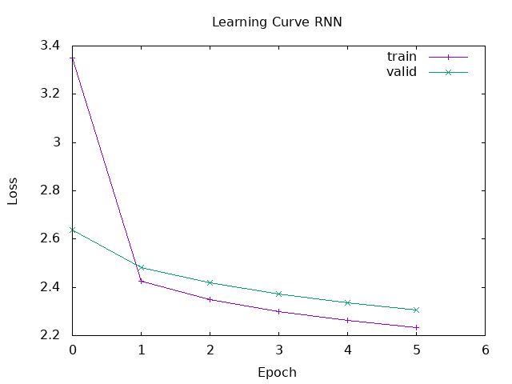
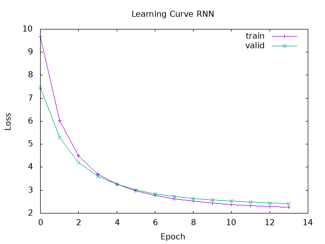

# Session 7 Report - Recurrent Neural Networks

## 1 - With random Embeddings
```text
*** Training ***
Epoch 1
  Training 625/625
  Validation 157/157
  Train Loss:   3.350867e0 | Val Loss:   2.636260e0
Epoch 2
  Training 625/625
  Validation 157/157
  Train Loss:   2.424861e0 | Val Loss:   2.481319e0
Epoch 3
  Training 625/625
  Validation 157/157
  Train Loss:   2.348468e0 | Val Loss:   2.418186e0
Epoch 4
  Training 625/625
  Validation 157/157
  Train Loss:   2.299664e0 | Val Loss:   2.372103e0
Epoch 5
  Training 625/625
  Validation 157/157
  Train Loss:   2.262176e0 | Val Loss:   2.336182e0
Epoch 6
  Training 625/625
  Validation 157/157
  Train Loss:   2.232125e0 | Val Loss:   2.307094e0

*** Results ***
             precision    recall    f1-score    support
             ------------------------------------------
    Class  0       NaN       NaN         NaN          0
    Class  1       NaN      0.00         NaN        878
    Class  2      0.08      0.02        0.03        307
    Class  3      0.10      0.22        0.14        487
    Class  4      0.14      0.71        0.24        726
    Class  5      0.53      0.05        0.10       2602
             ------------------------------------------
    accuracy                            0.15       5000
   macro avg       NaN       NaN         NaN       5000
weighted avg       NaN       NaN         NaN       5000

Confusion Matrix
+----------+--------+--------+--------+--------+--------+--------+
|          | Pred 0 | Pred 1 | Pred 2 | Pred 3 | Pred 4 | Pred 5 |
+----------+--------+--------+--------+--------+--------+--------+
| Actual 0 |      0 |      0 |      0 |      0 |      0 |      0 |
+----------+--------+--------+--------+--------+--------+--------+
| Actual 1 |      0 |      0 |     26 |    206 |    604 |     42 |
+----------+--------+--------+--------+--------+--------+--------+
| Actual 2 |      0 |      0 |      5 |     78 |    211 |     13 |
+----------+--------+--------+--------+--------+--------+--------+
| Actual 3 |      0 |      0 |      8 |    108 |    356 |     15 |
+----------+--------+--------+--------+--------+--------+--------+
| Actual 4 |      0 |      0 |      5 |    149 |    518 |     54 |
+----------+--------+--------+--------+--------+--------+--------+
| Actual 5 |      0 |      0 |     19 |    525 |   1919 |    139 |
+----------+--------+--------+--------+--------+--------+--------+
```



As we can see, the model with random embeddings does not perform well. I think i can improve it by a longer training on more data. But, because the embedding is random, the model does not learn any meaningful representation of the data.

## 2 - With pre-trained Embeddings

```
*** Training ***
Epoch 1
  Training 625/625
  Validation 157/157
  Train Loss:   9.666675e0 | Val Loss:   7.456607e0
Epoch 2
  Training 625/625
  Validation 157/157
  Train Loss:   6.012417e0 | Val Loss:   5.287543e0
Epoch 3
  Training 625/625
  Validation 157/157
  Train Loss:   4.494433e0 | Val Loss:   4.214151e0
Epoch 4
  Training 625/625
  Validation 157/157
  Train Loss:   3.710566e0 | Val Loss:   3.619213e0
Epoch 5
  Training 625/625
  Validation 157/157
  Train Loss:   3.254749e0 | Val Loss:   3.254873e0
Epoch 6
  Training 625/625
  Validation 157/157
  Train Loss:   2.962556e0 | Val Loss:   3.014747e0
Epoch 7
  Training 625/625
  Validation 157/157
  Train Loss:   2.763341e0 | Val Loss:   2.849098e0
Epoch 8
  Training 625/625
  Validation 157/157
  Train Loss:   2.622710e0 | Val Loss:   2.731250e0
Epoch 9
  Training 625/625
  Validation 157/157
  Train Loss:   2.520691e0 | Val Loss:   2.644783e0
Epoch 10
  Training 625/625
  Validation 157/157
  Train Loss:   2.444286e0 | Val Loss:   2.579060e0
Epoch 11
  Training 625/625
  Validation 157/157
  Train Loss:   2.385007e0 | Val Loss:   2.527282e0
Epoch 12
  Training 625/625
  Validation 157/157
  Train Loss:   2.337454e0 | Val Loss:   2.485157e0
Epoch 13
  Training 625/625
  Validation 157/157
  Train Loss:   2.298190e0 | Val Loss:   2.449944e0
Epoch 14
  Training 625/625
  Validation 157/157
  Train Loss:   2.264983e0 | Val Loss:   2.419858e0

*** Results ***
             precision    recall    f1-score    support
             ------------------------------------------
    Class  0       NaN       NaN         NaN          0
    Class  1      0.27      0.00        0.01        878
    Class  2      0.05      0.04        0.05        307
    Class  3      0.10      0.29        0.15        487
    Class  4      0.15      0.59        0.24        726
    Class  5      0.59      0.12        0.20       2602
             ------------------------------------------
    accuracy                            0.18       5000
   macro avg       NaN       NaN         NaN       5000
weighted avg       NaN       NaN         NaN       5000

Confusion Matrix
+----------+--------+--------+--------+--------+--------+--------+
|          | Pred 0 | Pred 1 | Pred 2 | Pred 3 | Pred 4 | Pred 5 |
+----------+--------+--------+--------+--------+--------+--------+
| Actual 0 |      0 |      0 |      0 |      0 |      0 |      0 |
+----------+--------+--------+--------+--------+--------+--------+
| Actual 1 |      0 |      3 |     89 |    296 |    431 |     59 |
+----------+--------+--------+--------+--------+--------+--------+
| Actual 2 |      0 |      1 |     12 |     97 |    168 |     29 |
+----------+--------+--------+--------+--------+--------+--------+
| Actual 3 |      0 |      0 |     19 |    142 |    288 |     38 |
+----------+--------+--------+--------+--------+--------+--------+
| Actual 4 |      0 |      2 |     19 |    176 |    431 |     98 |
+----------+--------+--------+--------+--------+--------+--------+
| Actual 5 |      0 |      5 |     87 |    653 |   1540 |    317 |
+----------+--------+--------+--------+--------+--------+--------+

*** Saving learning curve and parameters... ***
```



The pretrained embeddings was a little bit better than the random embeddings.
