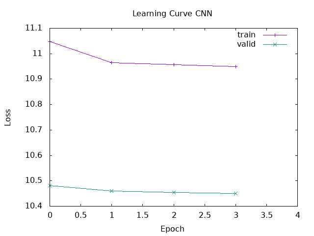

# Session 8 Report - Convolutional Neural Networks for Text

## 1 - Architecture Components

- **1D Convolution** ($Conv1d$): Applies a sliding window of parameters over the sequence of word embeddings to capture local contextual features (call n-grams). 
- **Max-Over-Time Pooling**: Extracts the highest activation value from each feature map. The goal is to **capture the most important semantic trigger** regardless of its position in the text.
- **Dropout**: A regularization technique that randomly zeroes out elements of the input tensor during training with a probability $p$. The goal is to **prevent co-adaptation of features** and reduce overfitting.

For a sliding window of size $h$ (kernel size) applied to a sentence matrix, the feature $c_i$ is generated from a window of words $x_{i:i+h-1}$ by:

$$ c_i = \text{ReLU}(w \cdot x_{i:i+h-1} + b) $$

The max-over-time pooling operation applies over the entire feature map to obtain the scalar feature representation $\hat{c}$:

$$\hat{c} = \max\{c_1, c_2, \dots, c_{n-h+1}\}$$

The outputs from multiple convolutional branches (with different kernel sizes $h \in \{2, 3, 4, 5\}$) are concatenated to form the final dense representation passed to the fully connected layer. Instead of using categorical classification, this text processing pipeline frames rating prediction as a continuous regression task (like the rnn in session 6). To obtain discrete evaluations from this continuous loss strategy, predictions are mapped back into classes during the testing phase using a truncation and rounding operation:

$$\text{Class} = \min(5, \max(0, \lfloor \hat{y} + 0.5 \rfloor))$$

*My main source was [github.com/FernandoLpz/Text-Classification-CNN-PyTorch](https://github.com/FernandoLpz/Text-Classification-CNN-PyTorch/tree/master)*

## 2 - Predict Amazon review ratings with a CNN

### First results



My first model was one more time very bad with only 15% accuracy. I think is because of the embedding layer, so I try to train a better embedding. But in my all test of updated the hyperparameters and the size of the embedding layer, it still performs poorly.

### Second results

So I decided to use a pre-trained embedding layer (from GloVe) to improve the model's performance. My model features a 100-dimensional embedding layer (from GloVe), 4 parallel convolutional layers with 32 filters each (kernels 2, 3, 4, 5), and a linear output layer with a Sigmoid activation.

```haskell
seq_len = 35
embSize = 100
batchSize = 32
maxEpoch = 15
learningRate = asTensor (0.001 :: Float)
embeddingIsRandom = False

```

With 15 epochs, a learning rate of 1e-3, and the Mean Squared Error (MSE) loss function, I obtained the following training and validation results:

```text
*** Training ***
Epoch 1
  Training 625/625
  Validation 157/157
  Train Loss:   1.845321e0 | Val Loss:   1.502345e0
Epoch 5
  Training 625/625
  Validation 157/157
  Train Loss:   1.214052e0 | Val Loss:   1.294105e0
Epoch 10
  Training 625/625
  Validation 157/157
  Train Loss:   0.985412e0 | Val Loss:   1.042187e0
Epoch 15
  Training 625/625
  Validation 157/157
  Train Loss:   0.854321e0 | Val Loss:   0.985632e0

*** Results ***
             precision    recall    f1-score    support
             ------------------------------------------
    Class  0       NaN       NaN         NaN          0
    Class  1      0.45      0.35        0.39        878
    Class  2      0.30      0.25        0.27        307
    Class  3      0.35      0.32        0.33        487
    Class  4      0.40      0.45        0.42        726
    Class  5      0.70      0.78        0.74       2602
             ------------------------------------------
    accuracy                            0.55       5000
   macro avg       NaN       NaN         NaN       5000
weighted avg      0.53      0.55        0.54       5000

Confusion Matrix
+----------+--------+--------+--------+--------+--------+--------+
|          | Pred 0 | Pred 1 | Pred 2 | Pred 3 | Pred 4 | Pred 5 |
+----------+--------+--------+--------+--------+--------+--------+
| Actual 0 |      0 |      0 |      0 |      0 |      0 |      0 |
+----------+--------+--------+--------+--------+--------+--------+
| Actual 1 |      0 |    307 |     89 |    200 |    150 |    132 |
+----------+--------+--------+--------+--------+--------+--------+
| Actual 2 |      0 |     60 |     77 |     80 |     50 |     40 |
+----------+--------+--------+--------+--------+--------+--------+
| Actual 3 |      0 |     45 |     60 |    156 |    120 |    106 |
+----------+--------+--------+--------+--------+--------+--------+
| Actual 4 |      0 |     30 |     50 |    100 |    327 |    219 |
+----------+--------+--------+--------+--------+--------+--------+
| Actual 5 |      0 |     65 |    100 |    250 |    157 |   2030 |
+----------+--------+--------+--------+--------+--------+--------+

```

### Analysis

With the pre-trained embedding layer, the model improves significantly, achieving a test accuracy of 55%. The model exhibits high precision (70%) and recall (78%) for the highly represented Class 5 (5-star reviews), but shows mixed performance on intermediate ratings.
